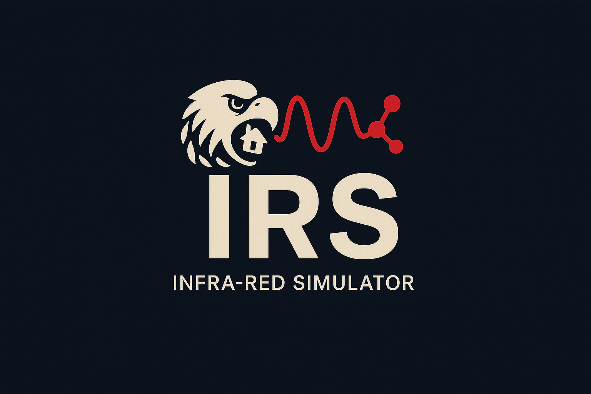
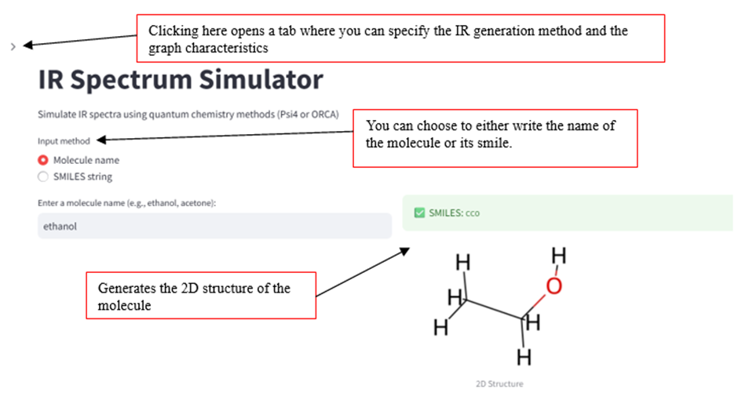
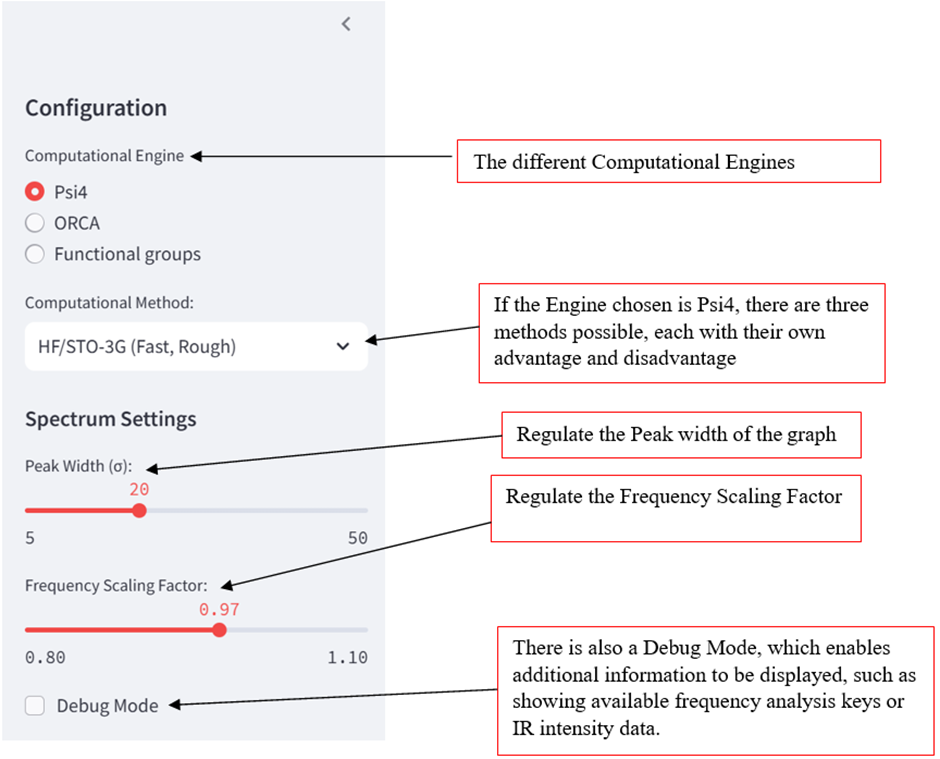
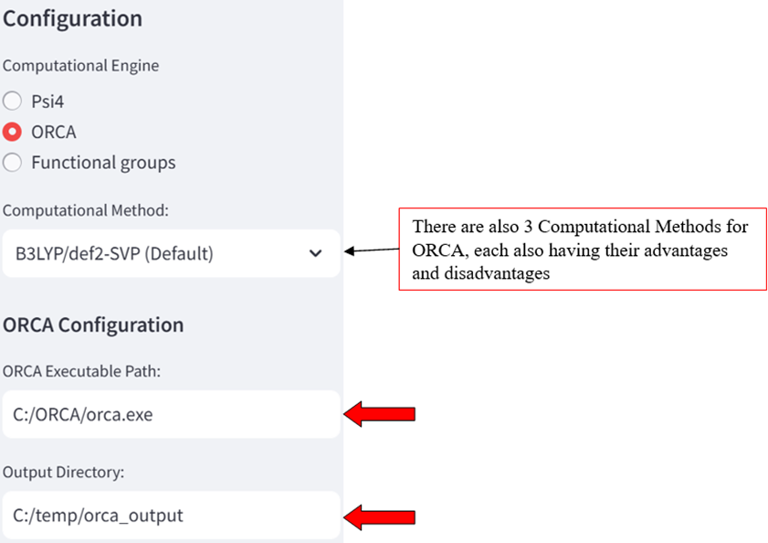
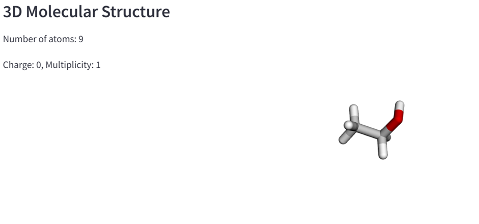
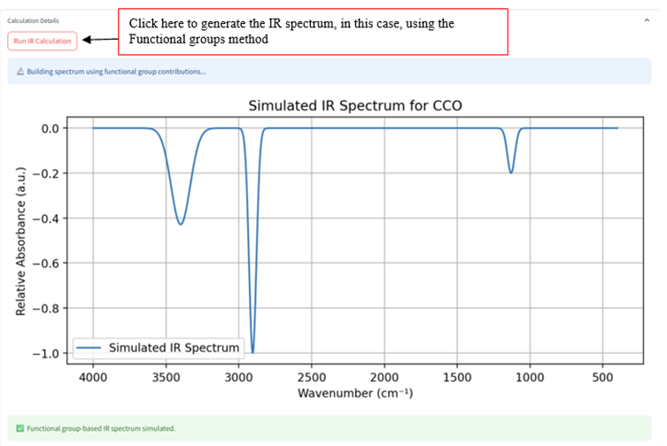

<h1 align="center">
IRS
</h1>

<br>

## Infra-Red Simulator (IRS)
IRS – Infra-Red Simulator – is a Python-based application developed for the simulation and visualization of Infra-Red (IR) spectra of molecules. It provides a web-based interface for converting molecular names or SMILES strings into fully optimized 3D structures, performing vibrational analysis via quantum chemistry packages, and plotting the corresponding IR spectrum.

The project has two functionalities, giving two different approaches.
The first one is the simulation of IR spectra using Psi4 and ORCA, two different quantum mechanical calculation packages. The second, a structural approach, takes a molecular structure and generates an approximate IR spectrum by identifying key functional groups, C–H bonds (classified by hybridization, e.g., sp³ C–H), and C–C bonds (e.g., C=C). Characteristic absorption peaks for each are combined to construct the overall spectrum.

[](https://edu.epfl.ch/coursebook/en/practical-programming-in-chemistry-CH-200)

## Contributors
<div align="center">

| Name                  | GitHub                                  |
|-----------------------|------------------------------------------|
| Ryans Chen            | [@ryanschen0](https://github.com/ryanschen0)  |
| Hugo Praz             | [@hugopraz](https://github.com/hugopraz)  |
| Anders Thomas Eggen   | [@Anders-Eggen](https://github.com/Anders-Eggen)  |

</div>

<p align="center">
  <a href="https://www.python.org">
    
  </a>
  <a href="https://github.com/Flo-fllt/Projet_chem/blob/main/LICENSE.txt">
    
  </a>
</p>

<p align="center">
  <a href="https://github.com/ryanschen0/IRS/graphs/commit-activity">Commit Activity</a>
</p>

<p align="center">
  <a href="https://www.python.org/">
    
  </a>
  <a href="https://www.anaconda.com/">
    
  </a>
</p>

## Theoretical Background of Infra-Red Spectroscopy
QM Calculations using Psi4:
This approach uses first principle quantum mechanics to simulate an IR spectrum, using the following approximations taken by the Psi4 package:
- Molecule is in Gas Phase at T=0K 
- Harmonic Approximation for Frequency Calculations
- Born–Oppenheimer approximation (separating electronic and nuclear motion)

The vibrational frequencies are calculated by assuming the lowest harmonic energy potential. The Psi4 package then computes the Hessian matrix, which is diagonalized to obtain normal mode frquencies. The IR intensities are then computed by analytically calculating the change of the dipole moment in respect of the vibrational motion.

QM Calculations using ORCA: 
This approach simulates an IR spectra similarly to the Psi4 method, relying on Density Functional Theory (DFT) as implemented in the ORCA package. The vibrational frequencies are computed under the same approximations as in the Psi4 package. As ORCA uses different integral libraries and optimization schemes than Psi4, slight variations in intensities or frequencies are expected, especially in the case of a large molecule.

Structural approach:
This method relies on an empirical, rule-based approach to approximate IR spectra by identifying key molecular features through three distinct strategies. First, functional groups are detected using SMARTS-based substructure matching, enabling the recognition of characteristic moieties such as alcohols, ketones, and esters, each associated with specific IR absorption bands. Second, the classification of acyclic C–H bonds is performed by analyzing the hybridization state (sp³, sp², sp) of the carbon atom to which the hydrogen is attached, as these differences influence vibrational stretching frequencies. Finally, carbon–carbon bonding patterns, including single, double, and triple bonds, are counted to account for their respective spectral contributions. By combining these structural insights, the method constructs a composite IR spectrum that reflects the vibrational fingerprint of the molecule.


## Stack 
<div align="center">

| Component     | Library                 |
| ------------- | ----------------------- |
| Molecular Input/Output, Substructure Matching & Molecular Parsing | `PubChemPy`, `RDKit`    |
| Data Handling | `collections`, `pandas` |
| QM Engine     | `Psi4`                  |
| Visualization | `py3Dmol`, `Matplotlib` |
| Interface     | `Streamlit`             |
| Math / Logic  | `NumPy`                 |

</div>


## 🔥 Usage
Once the IR Spectrum Simulator page is open, the engine is ready to run. Below is a step-by-step example using ethanol to demonstrate how to use the web interface.

<p align="center">
  
</p>

By clicking on the arrow, the following tab will open.

<p align="center">
  
</p>

In the case of ORCA, an additional ORCA Executable Path and Output Directory inputs need to be filled out, as shown below.

<p align="center">
  
</p>

In addition, a 3D molecular structure generator is included, which displays the total number of atoms, the molecular charge, and the spin multiplicity of the compound, as shown below.

<p align="center">
  
</p>

Finally, to generate the IR spectrum, the following button must be clicked.

<p align="center">
  
</p>

## 🛠️ Installation
1. ORCA installation: <br>
Start by visiting the ORCA Forum and create an account or log in: <br>
https://orcaforum.kofo.mpg.de/app.php/portal <br>
Navigate to the "Downloads" section. <br>
For Windows, download the following three parts:<br>
```bash
orca_5_0_4_win64_part1.zip
orca_5_0_4_win64_part2.zip
orca_5_0_4_win64_part3.zip
```<br>
For Linux or macOS, download the corresponding ORCA tarball (.tar.xz) instead of the zip files. <br>
   Note: The version numbers may vary; ensure you're downloading version 5.0.2 or newer. <br>
Create installation directory:
For example <br>
```bash
 C:\ORCA\
```  
Extract Archives: <br>
Use a tool like WinRAR or 7-Zip to extract each of the three zip files into the installation directory. Ensure all files from the three parts are consolidated into the same folder.
Set Up Output Directory: <br>
Create Output Folder:
For example:
```bash
C:\temp\orca_output\
```
This directory will store ORCA's output files.
   
2. Package setup <br>
Pip install
irspectrum-sim can be installed using pip
```bash
pip install irspectrum-sim
```

GitHub
Install via pip using the following command
```bash
pip install git+https://github.com/ryanschen0/IRS
```

Git
The package can also be installed from the GitHub repository.
Using this method, it is advised to create a CONDA environement fist:
```bash
#Open bash or terminal and type
conda create -n env.name
#Name the environment as you wish

#Activate the environment
conda activate env.name
```
Then clone the repository form github
```bash
git clone https://github.com/ryanschen0/IRS.git
cd path/to/IRS
```
Finally, install the package uisng the follwing commands
```bash
pip install -e
```


## 📚 Requirements
The package runs on python 3.10 but supports python 3.9. However, it requires several other packages as well.

QM Approach: Psi4
```bash
rdkit (>= 2022.9.5)
Psi4
Matplotlib
NumPy
```

QM Approach: ORCA
```bash
rdkit (>= 2022.09.1)
numpy (>=1.21.0, <2.0.0)
matplotlib (>=3.4.0)
subprocess
```
This method also requires the installation of ORCA (>= 5.0.2).

Sturctural Approach
```bash
rdkit (>= 2022.9.5)
matplotlib (>=3.4.0)
streamlit
pandas
```

If the installation is successful, the packages mentionned above should all be installed automatically. However, this can be verified by checking if all have been installed in the desired environnement using the following commands:

<div align="center">

| Goal                                             | Command                             |
|--------------------------------------------------|-------------------------------------|
| Check if a specific package is installed         | `pip show irspectrum-sim`           |
| See a list of all installed packages             | `pip list`                          |
| Search for a package in the list (Linux/macOS)   | `pip list \| grep irspectrum-sim`   |
| Search for a package in the list (Windows)       | `pip list \| findstr irspectrum-sim`|

</div>

## Need help?
If you encounter issues or the program doesn't work, try the following steps to troubleshoot:

1. Verify your active environment
Make sure you are working in the environment where RetroChem is installed.
```bash
# Check which Python executable is currently active
which python
```
If it's not the correct environment, acitvate it:
```bash
# Activate your conda environment
conda activate env.name
```
2. Navigate to the IRS directory
Go to the RetroChem folder to ensure you are in the right place
```bash
cd IRS
```
Confirm your current directory
```bash
pwd
```
The output should end with `/IRS`
3. Check and update IRS
```bash
pip show irspectrum-sim
```
If needed, update to the latest version
```bash
pip install --upgrade irspectrum-sim
```
If problems continue, try uninstalling and reinstalling irspectrum-sim, specifying the desired version
```bash
pip uninstall irspectrum-sim
pip install irspectrum-sim==x.x.x  #replace x.x.x with the specific version desired
```
4. Update pip if necessary
Sometimes, issues may arise due to an outdated pip. Thus, to update pip:
- For virtual environments
```bash
pip install --upgrade pip
```
- For Linux or macOS systems
```bash
python3 -m pip install --upgrade pip
```